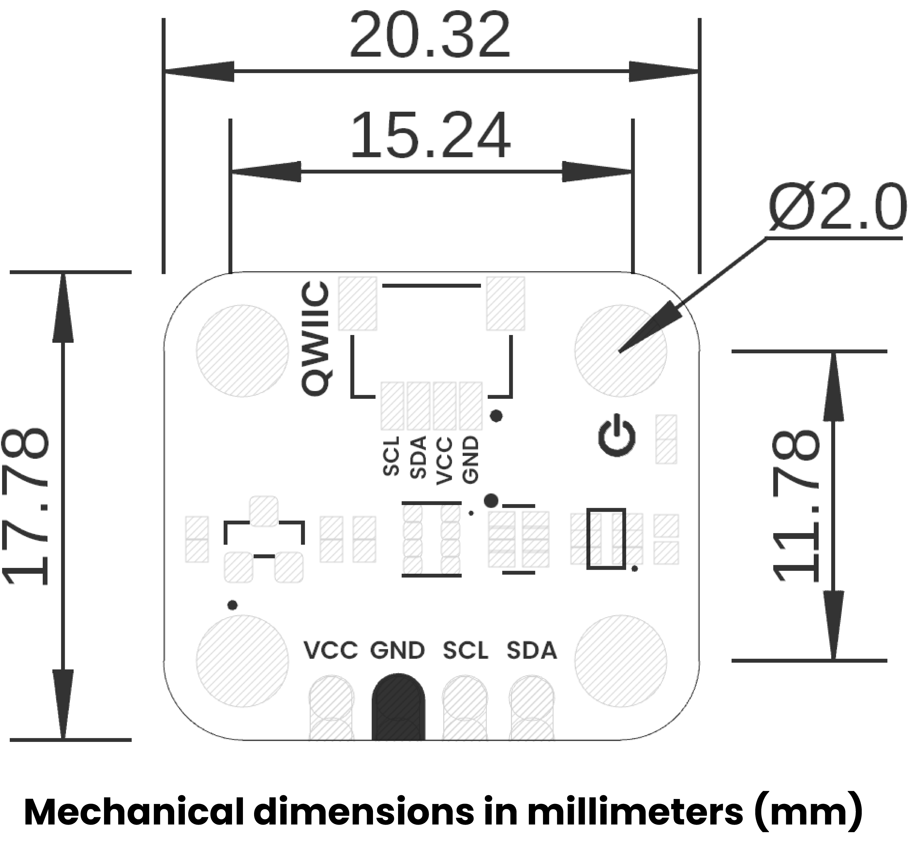
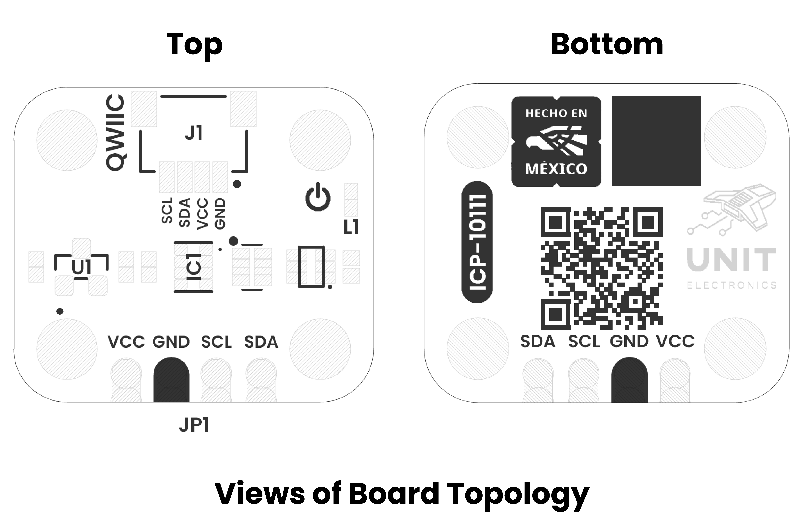

# Hardware

<a href=./unit_sch_V_0_0_1_ue0094_ICP-10111.pdf> schematic</a>

## Recommended Operating Conditions

| Symbol   | Description                                      | Min   | Typ | Max  | Unit |
|----------|--------------------------------------------------|-------|-----|------|------|
| VCC     | Input supply voltage (external input via VCC pin) | 3.6   | 5.0 | 6.0  | V    |
| VIL     | Low-level input voltage (I²C interface)           | –0.3  | –   | 0.99 | V    |
| VIH     | High-level input voltage (I²C interface)          | 2.31  | –   | 5.2  | V    |
| VOL     | Low-level output voltage (IOL = 3 mA)             | –     | –   | 0.4  | V    |
| VOH     | High-level output voltage (IOH = –3 mA)           | 2.4   | –   | 3.3  | V    |
| ICC     | Typical operating current (ICP-10111 active mode) | –     | 2.6 | –    | µA   |
| ISLEEP  | Low Power (LP, ICP-10111 active mode)             | –     | 1.3 | –    | µA   |
| RPULL   | I²C pull-up resistor to VCC                       | 4.7   | –   | 10   | kΩ   |
| TOP     | Operating temperature range                       | –40   | –   | +85  | °C   |

##  Pinout

    <a href="./unit_pinout_v_0_0_1_ue0094_icp10111_barometric_pressure_sensor_en.pdf"> Pinout</a>
     
     
     
    

| Pin Label | Function    | Notes                             |
|-----------|-------------|-----------------------------------|
| VCC       | Power Supply| 3.3V or 5V                       |
| GND       | Ground      | Common ground for all components  |

## Dimensions

<a href="./resources/unit_dimension_v_1_0_0_icp10111_barometric_pressure_sensor.png">  Dimensions</a>

## Topology

<a href="./resources/unit_topology_v_1_0_0_icp10111_barometric_pressure_sensor.png">  Topology</a>
 
 

| Ref. | Description                              |
|------|------------------------------------------|
| IC1  | ICP-10111 Barometric Pressure Sensor    |
| L1   | Power On LED                             |
| U1   | ME6206A18XG 1.8V Regulator               | 
| JP1  | 2.54 mm Castellated Holes                |
| J1   | QWIIC Connector (JST 1 mm pitch) for I2C |

## Pin & Connector Layout
| Pin   | Voltage Level | Function                                                  |
|-------|---------------|-----------------------------------------------------------|
| VCC   | 3.3 V – 5.5 V | Provides power to the on-board regulator and sensor core. |
| GND   | 0 V           | Common reference for power and signals.                   |
| SDA   | 1.8 V to VCC  | Serial data line for I²C communications.                  |
| SCL   | 1.8 V to VCC  | Serial clock line for I²C communications.                 |

> **Note:** The module also includes a Qwiic/STEMMA QT connector carrying the same four signals (VCC, GND, SDA, SCL) for effortless daisy-chaining.

## Functional Description

The ICP-10111 is a high-precision barometric pressure sensor module based on capacitive MEMS technology.  
- Measures absolute pressure over 30 kPa–110 kPa and integrates a temperature sensor for real-time thermal compensation.  
- Delivers ±1 Pa differential accuracy (≈5 cm altitude resolution) and ±1 hPa absolute accuracy across –40 °C…+85 °C.  
- Built-in 24-bit ΔΣ ADC and I²C interface allow direct digital readout without external amplification.  
- Three programmable power/noise modes (Ultra-Low Noise, Low Noise, Low Power) optimize trade-off between current draw and resolution.  
- Breakout board includes onboard 1.8 V regulator, level-shifting I/O and four mounting holes for easy integration.

## Applications

- Weather Stations & Barographs
- Altimeters & UAVs
- Indoor/Outdoor Navigation
- Wearables & IoT
- Climatology & Research
- Weather Forecasting

# References

- [ICP-10111 Datasheet](https://product.tdk.com/system/files/dam/doc/product/sensor/pressure/capacitive-pressure/data_sheet/ds-000177-icp-10111-v1.3.pdf)