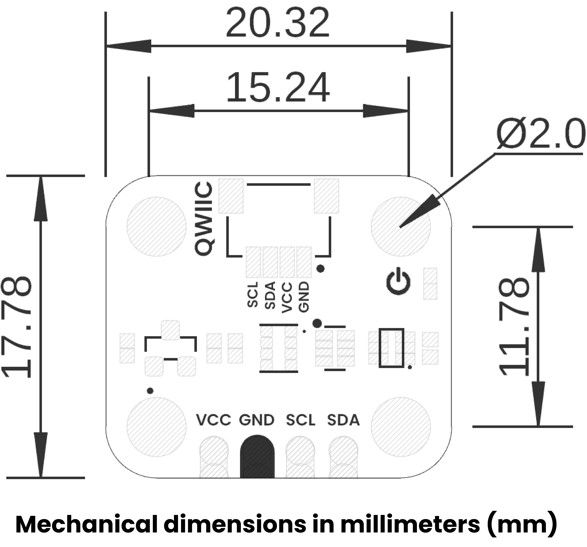

# Hardware

<a href="unit_sch_V_0_0_1_ue0094_ICP-10111.pdf"> Schematic</a>

## ⚙️ Technical Specifications

## 🔌 Pinout

    <a href="#"> Pinout</a>
     
     
     
    

| Pin Label | Function    | Notes                             |
|-----------|-------------|-----------------------------------|
| VCC       | Power Supply| 3.3V or 5V                       |
| GND       | Ground      | Common ground for all components  |

## 📏 Dimensions

<a href="./resources/unit_dimension_v_1_0_0_icp10111_barometric_pressure_sensor.png">  Dimensions</a>

## 📃 Topology

<a href="./resources/unit_topology_v_1_0_0_icp10111_barometric_pressure_sensor.png">  Topology</a>
 
 

| Ref. | Description                              |
|------|------------------------------------------|
| IC1  | ICP-10111 Barometric Pressure Sensor    |
| L1   | Power On LED                             |
| U1   | ME6206A18XG 1.8V Regulator               | 
| JP1  | 2.54 mm Castellated Holes                |
| J1   | QWIIC Connector (JST 1 mm pitch) for I2C |

# References

- [ICP-10111 Datasheet](https://product.tdk.com/system/files/dam/doc/product/sensor/pressure/capacitive-pressure/data_sheet/ds-000177-icp-10111-v1.3.pdf)