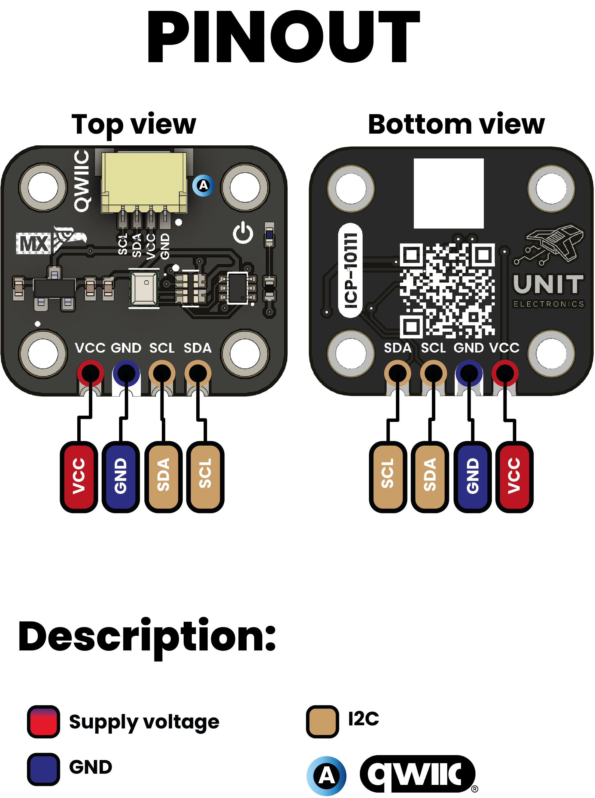

<!--
# README_TEMPLATE.md
This file serves as an input to generate a datasheet-style technical PDF.
Fill in each section without deleting or modifying the existing headings.
-->

# ICP-10111 Barometric Pressure Sensor

## KEY TECHNICAL SPECIFICATIONS

<!-- 
========================================
EDITABLE SPECIFICATIONS TEMPLATE
========================================
Edita los valores a continuación según necesites.
El formato se mantendrá automáticamente en el PDF generado.
-->

### 🔌 CONNECTIVITY (Conectividad)
<!-- Edita las interfaces y conectores disponibles -->
| Interface | Details |
|-----------|---------|
| **Primary Interface** | I²C (up to 400 kHz, address 0x63) |
| **Connector Type** | Qwiic + Pin Headers |
| **Logic Levels** | VCC-referenced (1.8V – 5.5V tolerant) |

### 🔧 MECHANICAL (Especificaciones Mecánicas)
<!-- Edita las dimensiones y características físicas -->
| Feature | Specification |
|---------|---------------|
| **Board Dimensions** | 20.32 mm × 17.78 mm |
| **Mounting Holes** | 4 × Ø 2.2 mm |
| **Weight** | ~2.5 g |
| **Package Type** | Compact breakout board |

<!-- 
========================================
NOTAS PARA EDICIÓN:
========================================
1. Para cambiar valores: simplemente edita el texto después del símbolo "|"
2. Para agregar nuevas filas: copia el formato "| **Parámetro** | Valor |"
3. Para cambiar categorías: edita los títulos con ### 
4. Los íconos (🔌⚡📊🌡️🔧) son opcionales pero ayudan a la organización visual
========================================
--> 

## Circuit Schematic

Complete circuit schematic showing all component connections

[View Complete Schematic PDF](../../hardware/unit_sch_V_0_0_1_ue0094_ICP-10111.pdf)

## Block Diagram

## Dimensions

## Usage

- Arduino IDE  
  - Install SparkFun_ICP10111 library via Library Manager  
  - Include <Wire.h> and <SparkFun_ICP10111.h> in your sketch  
- PlatformIO  
  - Add sparkfun/sparkfun-icp10111@^1.0.0 to lib_deps in platformio.ini  
- Raspberry Pi (Linux/C or Python)  
  - Use the I²C-1 bus (/dev/i2c-1) with smbus2 (Python) or i2c-dev (C)  
- CircuitPython / MicroPython  
  - Install adafruit_icp10111 from the Adafruit bundle  
  - Use busio.I2C or I2C() to communicate over SDA/SCL  
