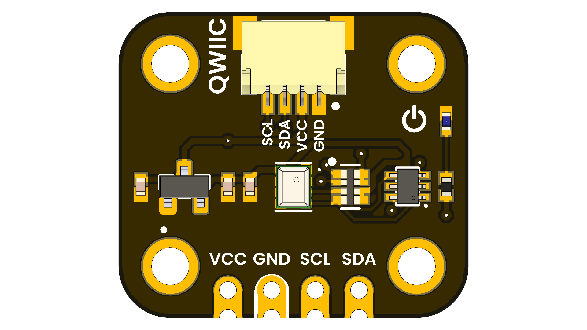
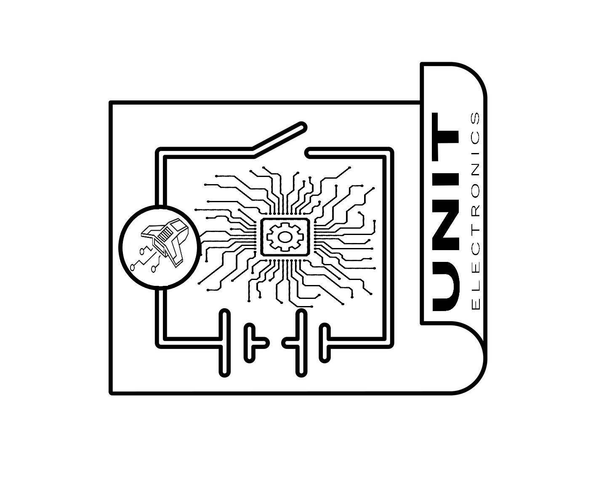

<!--
# README_TEMPLATE.md
This file serves as an input to generate a datasheet-style technical PDF.
Fill in each section without deleting or modifying the existing headings.
-->

# ICP-10111 Barometric Pressure Sensor

## Functional Description

The ICP-10111 is a high-precision barometric pressure sensor module based on capacitive MEMS technology.  
- Measures absolute pressure over 30 kPa–110 kPa and integrates a temperature sensor for real-time thermal compensation.  
- Delivers ±1 Pa differential accuracy (≈5 cm altitude resolution) and ±1 hPa absolute accuracy across –40 °C…+85 °C.  
- Built-in 24-bit ΔΣ ADC and I²C interface allow direct digital readout without external amplification.  
- Three programmable power/noise modes (Ultra-Low Noise, Low Noise, Low Power) optimize trade-off between current draw and resolution.  
- Breakout board includes onboard 1.8 V regulator, level-shifting I/O and four mounting holes for easy integration.

## Electrical Characteristics & Signal Overview

<!-- 
========================================
EDITABLE SPECIFICATIONS TEMPLATE
========================================
Edita los valores a continuación según necesites.
El formato se mantendrá automáticamente en el PDF generado.
-->

### 🔌 CONNECTIVITY (Conectividad)
<!-- Edita las interfaces y conectores disponibles -->
| Interface | Details |
|-----------|---------|
| **Primary Interface** | I²C (up to 400 kHz, address 0x63) |
| **Connector Type** | Qwiic + Pin Headers |
| **Logic Levels** | VCC-referenced (1.8V – 5.5V tolerant) |

### ⚡ POWER & INTERFACE (Alimentación e Interfaz)
<!-- Edita las especificaciones de voltaje y consumo -->
| Parameter | Specification |
|-----------|---------------|
| **Supply Voltage** | 3.3V – 5.5V (module), 1.8V (sensor core) |
| **Current Consumption** | |
| → Ultra-Low Noise (10 Hz) | 10.4 µA |
| → Low Noise (10 Hz) | 5.2 µA |
| → Low Power (10 Hz) | 1.3 µA |

### 📊 MEASUREMENT PERFORMANCE (Rendimiento de Medición)
<!-- Edita las especificaciones de precisión y rango -->
| Feature | Specification |
|---------|---------------|
| **Pressure Operating Range** | 30 to 110 kPa |
| **Pressure Sensor Absolute Accuracy** | ±1 hPa over 950 hPa–1050 hPa, 0°C to 65°C |
| **Pressure Sensor Relative Accuracy** | ±1 Pa for any 10 hPa change over 950 hPa–1050 hPa at 25°C |
| **Pressure Sensor Temperature Coefficient Offset** | ±0.5 Pa/°C over 25°C to 45°C at 100 kPa |
| **Temperature Sensor Absolute Accuracy** | ±0.4°C |
| **Noise and Current Consumption** | ULN mode: 0.4 Pa @ 10.4 µA, LN mode: 0.8 Pa @ 5.2 µA, LP mode: 3.2 Pa @ 1.3 µA |

### 🌡️ ENVIRONMENTAL (Condiciones Ambientales)
<!-- Edita las condiciones de operación -->
| Parameter | Range |
|-----------|-------|
| **Operating Temperature** | -40°C to +85°C (industrial grade) |
| **Storage Temperature** | -40°C to +85°C |
| **Humidity** | 0% to 100% RH (non-condensing) |

### 🔧 MECHANICAL (Especificaciones Mecánicas)
<!-- Edita las dimensiones y características físicas -->
| Feature | Specification |
|---------|---------------|
| **Board Dimensions** | 20.32 mm × 17.78 mm |
| **Mounting Holes** | 4 × Ø 2.2 mm |
| **Weight** | ~2.5 g |
| **Package Type** | Compact breakout board |

<!-- 
========================================
NOTAS PARA EDICIÓN:
========================================
1. Para cambiar valores: simplemente edita el texto después del símbolo "|"
2. Para agregar nuevas filas: copia el formato "| **Parámetro** | Valor |"
3. Para cambiar categorías: edita los títulos con ### 
4. Los íconos (🔌⚡📊🌡️🔧) son opcionales pero ayudan a la organización visual
========================================
--> 

## Applications

<!-- FILL HERE -->
- Weather Stations & Barographs

- Altimeters & UAVs

- Indoor/Outdoor Navigation

- Wearables & IoT

- Climatology & Research

- Weather Forecasting

## Features

- Board Dimensions 20.32 mm × 17.78 mm
- Mounting Holes 4 × Ø 2.2 mm
- High-stability MEMS capacitive pressure sensor with low drift  
- Integrated temperature sensor for on-board compensation  
- Ultra-low-noise ΔΣ ADC with 24-bit resolution  
- Three user-selectable power/noise modes for optimized current usage  
- Qwiic/STEMMA QT connector for solder-free I²C daisy-chaining  
- On-board level shifting and 1.8 V core regulator    
- Wide operating range: –40 °C to +85 °C, 30 kPa to 110 kPa

## Pin & Connector Layout
| Pin   | Voltage Level | Function                                                  |
|-------|---------------|-----------------------------------------------------------|
| VCC   | 3.3 V – 5.5 V | Provides power to the on-board regulator and sensor core. |
| GND   | 0 V           | Common reference for power and signals.                   |
| SDA   | 1.8 V to VCC  | Serial data line for I²C communications.                  |
| SCL   | 1.8 V to VCC  | Serial clock line for I²C communications.                 |

> **Note:** The module also includes a Qwiic/STEMMA QT connector carrying the same four signals (VCC, GND, SDA, SCL) for effortless daisy-chaining.

## Settings

### Interface Overview

| Interface | Signals / Pins                            | Typical Use                                      |
|-----------|-------------------------------------------|-------------------------------------------------|
| I²C       | SDA, SCL, VCC, GND (via Qwiic/STEMMA QT™) | Main digital interface for pressure & temperature |

### Supports

| Symbol | I/O Type      | Description                                |
|--------|---------------|--------------------------------------------|
| VCC    | Power Input   | 3.3 V–5.5 V supply for on-board regulator  |
| GND    | Ground        | Common system ground                       |
| SDA    | Bidirectional | I²C data line (7-bit address 0x63 default) |
| SCL    | Bidirectional | I²C clock line                             |

## Circuit Schematic

Complete circuit schematic showing all component connections

[View Complete Schematic PDF](../../hardware/unit_sch_V_0_0_1_ue0094_ICP-10111.pdf)

## Block Diagram

## Dimensions

## Usage

- Arduino IDE  
  - Install SparkFun_ICP10111 library via Library Manager  
  - Include <Wire.h> and <SparkFun_ICP10111.h> in your sketch  
- PlatformIO  
  - Add sparkfun/sparkfun-icp10111@^1.0.0 to lib_deps in platformio.ini  
- Raspberry Pi (Linux/C or Python)  
  - Use the I²C-1 bus (/dev/i2c-1) with smbus2 (Python) or i2c-dev (C)  
- CircuitPython / MicroPython  
  - Install adafruit_icp10111 from the Adafruit bundle  
  - Use busio.I2C or I2C() to communicate over SDA/SCL  
